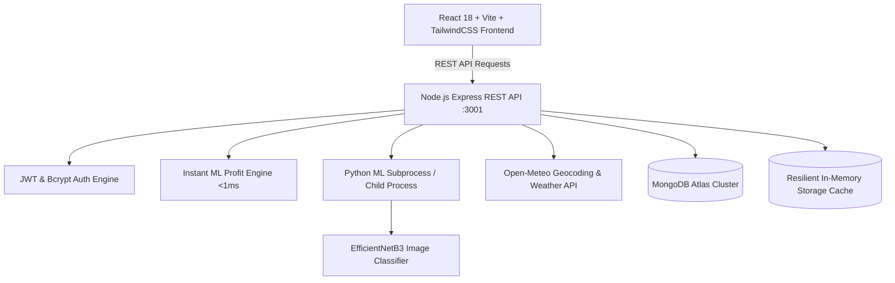

# AgriMind Unified Platform — Comprehensive System & Feature Documentation

> **Platform Overview:**  
> **AgriMind** is an end-to-end Smart Poultry Intelligence, Diagnostics, and Trade Platform designed for poultry farmers, veterinarians, and agricultural enterprise teams. It unifies **Machine Learning Profit Forecasting**, **Deep Learning Poultry Disease Diagnostics**, **Multi-Farm Operational Management**, **AgriShop Trade Marketplace**, **Live Geocoded Farm Weather**, and **Role-Based Authentication & Farmer Support**.

---

## Table of Contents
1. [System Architecture & Technology Stack](#1-system-architecture--technology-stack)
2. [Feature 1: User Authentication & Role Management](#2-feature-1-user-authentication--role-management)
3. [Feature 2: Multi-Farm Management & Live Farm Intelligence](#3-feature-2-multi-farm-management--live-farm-intelligence)
4. [Feature 3: Automated ML Profit Forecasting & Financial Engine](#4-feature-3-automated-ml-profit-forecasting--financial-engine)
5. [Feature 4: Deep Learning Poultry Disease Diagnostics](#5-feature-4-deep-learning-poultry-disease-diagnostics)
6. [Feature 5: AgriShop Marketplace & Farmer Trade Hub](#6-feature-5-agrishop-marketplace--farmer-trade-hub)
7. [Feature 6: Live Farm Microclimate & Weather Service](#7-feature-6-live-farm-microclimate--weather-service)
8. [Feature 7: Audit Logs & Prediction History](#8-feature-7-audit-logs--prediction-history)
9. [Feature 8: Employee Farmer Support & Account Lookup](#9-feature-8-employee-farmer-support--account-lookup)
10. [Data Flow & Database Schema Reference](#10-data-flow--database-schema-reference)

---

## 1. System Architecture & Technology Stack



- **Frontend:** React 18, Vite 5, TailwindCSS, Lucide Icons, Bilingual UI (English & Bangla).
- **Backend API:** Node.js, Express 4, CORS, Multer (multipart image processing), JSON Web Token (JWT), BcryptJS.
- **Machine Learning Core:**
  - **Disease Detection:** Python 3, PyTorch / TensorFlow Keras, PIL, NumPy, EfficientNetB3 backbone.
  - **Profit Analytics:** Analytical biological calibration engine + Python Scikit-Learn Gradient Boosting / Lasso regression models.
- **Data Layer:** Dual-resilient persistence: MongoDB Atlas via Mongoose with automatic fallback to high-speed in-memory maps for offline operation.

---

## 2. Feature 1: User Authentication & Role Management

### How It Works
- Provides user onboarding, login verification, password management, and role-based access control (`farmer` vs `employee`).
- Automatically generates secure 30-day JWT tokens upon successful credentials validation.
- When an employee logs in, additional privileged capabilities (such as the **Employee Tools** tab) are dynamically unlocked.
- Features bilingual localization (English/Bangla toggle) across all authentication dialogues.
- Includes a dedicated `ForgotPasswordModal` with direct enterprise helpline support contact information.

### API Endpoints
- `POST /api/auth/register` — User registration
- `POST /api/auth/login` — User authentication & token generation
- `GET /api/auth/me` — Retrieve active authenticated user profile
- `PUT /api/user/profile` — Update phone number and password

### Inputs & Outputs

#### A. Registration (`POST /api/auth/register`)
- **Inputs (Request Body - JSON):**
  | Parameter | Type | Required | Constraints / Description |
  | :--- | :--- | :--- | :--- |
  | `name` | String | Yes | Full name of the farmer or employee (e.g. `"Mohammad Rahman"`). |
  | `mobile` | String | Yes | Exact 11-digit mobile number starting with `01` (e.g. `"01712345678"`). |
  | `password` | String | Yes | Minimum 6 characters. |
  | `role` | String | No | Role designation: `'farmer'` (default) or `'employee'`. |

- **Outputs (Response - JSON):**
  ```json
  {
    "success": true,
    "token": "eyJhbGciOiJIUzI1NiIsInR5cCI6IkpXVCJ9...",
    "user": {
      "id": "65fc20a1b9...",
      "name": "Mohammad Rahman",
      "mobile": "01712345678",
      "role": "farmer"
    }
  }
  ```

#### B. Login (`POST /api/auth/login`)
- **Inputs (Request Body - JSON):**
  | Parameter | Type | Required | Description |
  | :--- | :--- | :--- | :--- |
  | `mobile` | String | Yes | Registered 11-digit mobile number. |
  | `password` | String | Yes | Account password. |

- **Outputs (Response - JSON):**
  ```json
  {
    "success": true,
    "token": "eyJhbGciOiJIUzI1NiIsInR5cCI6IkpXVCJ9...",
    "user": {
      "id": "65fc20a1b9...",
      "name": "Mohammad Rahman",
      "mobile": "01712345678",
      "role": "farmer"
    }
  }
  ```

#### C. Profile Update (`PUT /api/user/profile`)
- **Inputs (Headers & Request Body):**
  - Header: `Authorization: Bearer <token>`
  - Body:
    | Parameter | Type | Required | Description |
    | :--- | :--- | :--- | :--- |
    | `mobile` | String | Optional | Updated 11-digit mobile number. |
    | `currentPassword` | String | Conditional | Required if updating password. |
    | `newPassword` | String | Optional | New password (minimum 6 characters). |

- **Outputs (Response - JSON):**
  ```json
  {
    "success": true,
    "message": "Profile updated successfully!",
    "user": {
      "id": "65fc20a1b9...",
      "name": "Mohammad Rahman",
      "mobile": "01799887766",
      "role": "farmer"
    }
  }
  ```

---

## 3. Feature 2: Multi-Farm Management & Live Farm Intelligence

### How It Works
- Farmers can create, inspect, switch between, update, and delete multiple poultry farms.
- The **Dashboard** hosts an immediate poultry farm registration form.
- The **My Farm** view displays high-level analytics, active flock status, breed badges, financial overview cards, live microclimate weather, and farm editing tools.
- Every farm update recalculates the full machine learning profit model instantly.

### API Endpoints
- `POST /api/farms` — Register a new poultry farm & calculate ML profit
- `GET /api/farms` — Fetch all registered farms
- `GET /api/farms/:id` — Fetch details and live calculations for a specific farm
- `PUT /api/farms/:id` — Update farm parameters & recalculate profit
- `DELETE /api/farms/:id` — Remove farm and its associations

### Inputs & Outputs

#### Farm Creation & Update (`POST /api/farms` & `PUT /api/farms/:id`)
- **Inputs (Request Body - JSON):**
  | Parameter Category | Field Name | Type | Default | Description |
  | :--- | :--- | :--- | :--- | :--- |
  | **Identity & Contact** | `farmName` | String | *(Required)* | Name of the poultry farm. |
  | | `ownerName` | String | *(Required)* | Full name of the owner/manager. |
  | | `phoneNumber` | String | *(Required)* | Contact phone number. |
  | | `country` | String | `'Bangladesh'` | Country of operation. |
  | | `city` | String | `'Dhaka'` | District/city for location-based weather. |
  | **Flock Characteristics** | `chickenType` | Enum | `'Broiler'` | One of: `'Sonali'`, `'Broiler'`, `'Desi'`, `'Cock'`, `'Layer'`. |
  | | `initialChickens` | Number | `1700` | Count of day-old chicks / initial flock size. |
  | | `averageChickens` | Number | `1650` | Average active birds over the cycle. |
  | | `ageMonths` | Number | `2` | Age of flock in months. |
  | | `mortality` | Number | `50` | Total bird mortality count during the cycle. |
  | **Feed & Market Prices**| `feedKg` | Number | `5500` | Total feed consumption in kg. |
  | | `feedPricePerKg` | Number | `53.25` | Purchase price per kg of poultry feed (BDT). |
  | | `averageMarketChickenPrice` | Number | `195.0` | Benchmark live chicken market price per kg. |
  | | `averageMarketEggPrice` | Number | `11.8` | Benchmark market price per egg (BDT). |
  | **Operating Overheads** | `medicineCost` | Number | `30000` | Antibiotics, vitamins, and supplements (BDT). |
  | | `vaccinationCost` | Number | `12000` | Vaccines (ND, Gumboro, Marek's) cost (BDT). |
  | | `laborCost` | Number | `48000` | Farm labor and management wages (BDT). |
  | | `electricityCost` | Number | `21000` | Brooding heaters, lighting, ventilation fans (BDT). |
  | | `waterCost` | Number | `6000` | Water pumping and sanitization (BDT). |
  | | `transportCost` | Number | `15000` | Chick and feed transport logistics (BDT). |
  | | `otherCost` | Number | `9000` | Litter bedding, maintenance, miscellaneous (BDT). |
  | **Harvest Yields** | `chickensSold` | Number | `1550` | Count of live birds sold at harvest. |
  | | `averageWeightKg` | Number | `2.2` | Average live weight per bird at sale (kg). |
  | | `chickenPricePerKg` | Number | `195.0` | Realized selling price per kg. |
  | | `eggsProduced` | Number | `0` | Total eggs harvested (for Layers/dual breeds). |
  | | `brokenEggs` | Number | `0` | Count of cracked or damaged eggs. |
  | | `eggsSold` | Number | `0` | Count of intact table eggs sold. |
  | | `brokenEggPrice` | Number | `0` | Discounted sale price for cracked eggs (BDT). |
  | | `eggPrice` | Number | `11.8` | Realized price per intact egg (BDT). |

- **Outputs (Response - JSON):**
  ```json
  {
    "success": true,
    "farm": {
      "_id": "65fc20a1b9...",
      "farmName": "Green Valley Agro",
      "ownerName": "Mohammad Rahman",
      "phoneNumber": "01712345678",
      "country": "Bangladesh",
      "city": "Gazipur",
      "chickenType": "Broiler",
      "initialChickens": 1700,
      "averageChickens": 1650,
      "ageMonths": 2,
      "feedKg": 5500,
      "mortality": 50,
      "profitResult": {
        "success": true,
        "used_ml_model": true,
        "predicted_profit": 87520.50,
        "actual_calculated_profit": 89200.00,
        "breakdown": {
          "total_revenue": 665000.00,
          "total_cost": 575800.00,
          "feed_cost": 292875.00,
          "non_feed_cost": 282925.00,
          "egg_revenue": 0.00,
          "chicken_revenue": 665000.00,
          "eggs_produced": 0,
          "eggs_sold": 0,
          "broken_eggs": 0,
          "breakage_rate_percent": 0.0,
          "mortality_rate_percent": 2.94,
          "feed_per_chicken_kg": 3.33,
          "other_cost_per_chicken": 171.47
        }
      },
      "createdAt": "2026-03-23T14:30:00.000Z",
      "updatedAt": "2026-03-23T14:30:00.000Z"
    }
  }
  ```

---

## 4. Feature 3: Automated ML Profit Forecasting & Financial Engine

### How It Works
- Runs in sub-millisecond execution time (`<1ms`) with zero subprocess cold-start latency.
- Incorporates biological breed profiles:
  - **Broiler:** Meat breed, harvest weight ~2.10 kg, optimal Feed Conversion Ratio (FCR) ~1.60.
  - **Sonali:** Dual-purpose crossbreed, harvest weight ~1.15 kg, optimal FCR ~2.45, laying rate ~60%.
  - **Desi:** Indigenous breed, harvest weight ~1.25 kg, optimal FCR ~2.80, premium market pricing.
  - **Cock:** Meat cockerel, harvest weight ~1.15 kg, optimal FCR ~2.70.
  - **Layer:** Commercial egg producer, harvest weight ~1.65 kg, optimal FCR ~2.20, lay rate ~82%, salvage hen value at end-of-lay.
- Calculates cost vs. revenue breakdown and evaluates non-linear biological penalties (FCR deviation, excess mortality penalty, egg breakage loss) to predict true realized commercial profits.

### Mathematical & Economic Formulae
1. **Total Operational Cost:**
   $$\text{Total Cost} = (\text{feedKg} \times \text{feedPricePerKg}) + \sum \text{Non-Feed Costs}$$
2. **Chicken Revenue:**
   $$\text{Chicken Revenue} = \text{chickensSold} \times \text{averageWeightKg} \times \text{chickenPricePerKg} \times \text{salvageFactor}$$
3. **Egg Revenue:**
   $$\text{Egg Revenue} = (\text{eggsSold} \times \text{eggPrice}) + (\text{brokenEggs} \times \text{brokenEggPrice})$$
4. **Egg Breakage Loss:**
   $$\text{Broken Egg Loss} = \text{brokenEggs} \times \max(0, \text{eggPrice} - \text{brokenEggPrice})$$
5. **Feed Conversion & Biological Efficiency Factor ($\eta$):**
   $$\text{FCR Delta} = \frac{\text{feedKg} - (\text{averageChickens} \times \text{weight} \times \text{FCR}_{\text{optimal}})}{\text{Expected Feed}}$$
   $$\eta = 1.0 - \text{Clamp}(\text{FCR Delta} \times 0.5, -0.08, 0.08) - ((\text{Mortality Rate} - 0.04) \times 0.4)$$
6. **ML Predicted Profit:**
   $$\text{Predicted Profit} = (\text{Total Revenue} \times \eta) - \text{Total Cost}$$

### Inputs & Outputs
- **Inputs:** Flock parameters, overhead items, and market unit rates (see parameters in Feature 2).
- **Outputs (`profitResult`):**
  - `predicted_profit` (BDT)
  - `actual_calculated_profit` (BDT)
  - `breakdown.total_revenue`
  - `breakdown.total_cost`
  - `breakdown.feed_cost`
  - `breakdown.non_feed_cost`
  - `breakdown.chicken_revenue`
  - `breakdown.egg_revenue`
  - `breakdown.broken_egg_loss`
  - `breakdown.breakage_rate_percent`
  - `breakdown.lay_rate_percent`
  - `breakdown.mortality_rate_percent`
  - `breakdown.feed_per_chicken_kg`
  - `breakdown.other_cost_per_chicken`

---

## 5. Feature 4: Deep Learning Poultry Disease Diagnostics

### How It Works
- Farmers take a photo of poultry fecal droppings and upload it through drag-and-drop or file picker.
- Multer processes and validates the image on the Express server (JPEG, PNG, WEBP, GIF, max 10MB).
- Express invokes the Python ML pipeline (`ml/pipelines/infer_disease.py`).
- The pipeline processes the image through an **EfficientNetB3** deep learning network accompanied by computer vision feature extraction (analyzing hemoglobin/blood color ratios, bile-green hue saturation, uric acid capping, and watery diarrhea texture).
- Confirms diagnostic confidence threshold ($\ge 70\%$). If below, it safely prompts the user to submit a clearer close-up image.
- Yields disease classification, probability bars, symptoms, and veterinarian-approved medical treatment guidelines.
- Automatically saves the diagnosis to the MongoDB **Prediction History** log.

### Supported Disease Classes
1. **Coccidiosis:** Bloody, reddish-brown mucus caused by *Eimeria* intestinal protozoa.
2. **Salmonella (Fowl Typhoid / Pullorum):** Chalky white or yellowish-green watery diarrhea.
3. **NewCastle Disease (Ranikhet):** Bright greenish diarrhea, respiratory gasping, torticollis (twisted neck).
4. **Healthy:** Firm greyish-brown fecal droppings with distinct white uric acid caps.

### API Endpoints
- `POST /api/predict/disease` — Upload dropping image for analysis

### Inputs & Outputs

#### Image Upload & Diagnosis (`POST /api/predict/disease`)
- **Inputs (Multipart Form-Data):**
  | Parameter | Type | Required | Description |
  | :--- | :--- | :--- | :--- |
  | `image` | File (Binary) | Yes | Image file of poultry fecal droppings (JPG, PNG, WEBP). |
  | `farmId` | String | No | Target farm ID to associate diagnosis with farm history. |

- **Outputs (Response - JSON):**
  ```json
  {
    "success": true,
    "identified": true,
    "prediction": "Coccidiosis",
    "confidence": 0.9142,
    "probabilities": {
      "Coccidiosis": 0.9142,
      "Salmonella": 0.0286,
      "NewCastle Disease": 0.0286,
      "Healthy": 0.0286
    },
    "advisory": {
      "description": "Characterized by bloody, reddish-brown mucus in droppings caused by Eimeria parasites.",
      "symptoms": "Bloody droppings, ruffled feathers, lethargy, decreased feed intake.",
      "recommended_treatment": "Administer Amprolium (0.024% in drinking water for 5-7 days) or Toltrazuril. Ensure dry litter."
    }
  }
  ```

---

## 6. Feature 5: AgriShop Marketplace & Farmer Trade Hub

### How It Works
- A specialized agricultural trading hub bridging poultry equipment manufacturers, pharmaceutical vendors, and local farmers.
- Features categorized browsing, live keyword search, seller contact modals, and farmer listing creation.
- Pre-loaded with essential commercial farming catalog items (drinker systems, automated shed thermostats, brooder gas heaters, vaccines like ND Lasota, broad-spectrum antibiotics, Virkon-S biosecurity disinfectant).
- Farmers can list their own produce (live broiler batches, farm-fresh eggs, organic chicken manure, extra gear) directly into the community marketplace.

### API Endpoints
- `GET /api/products` — Filter products by category or search query
- `POST /api/products` — List a new item for sale

### Inputs & Outputs

#### A. Browse Products (`GET /api/products`)
- **Inputs (Query Parameters):**
  | Parameter | Type | Required | Description |
  | :--- | :--- | :--- | :--- |
  | `category` | String | No | One of: `'All'`, `'Instruments'`, `'Medicines'`, `'Vaccines'`, `'Feed'`, `'Farmer Products'`. |
  | `search` | String | No | Case-insensitive keyword matching title, description, or seller location. |

- **Outputs (Response - JSON):**
  ```json
  {
    "success": true,
    "count": 1,
    "products": [
      {
        "_id": "prod_inst_1",
        "name": "Automatic Poultry Nipple Drinker Kit (10 Pack)",
        "category": "Instruments",
        "price": 1200,
        "unit": "10 pcs set",
        "sellerName": "AgriTech Poultry Equipments Ltd.",
        "sellerPhone": "+880 1812-334455",
        "sellerLocation": "Gazipur, Dhaka",
        "description": "High-grade 360-degree stainless steel nipple drinkers with leak-proof rubber gaskets.",
        "image": "https://images.unsplash.com/photo-1548550023-2bdb3c5beed7?auto=format&fit=crop&w=600&q=80",
        "stock": 45,
        "rating": 4.8,
        "badge": "Best Seller",
        "isFarmerListing": false
      }
    ]
  }
  ```

#### B. Create Listing (`POST /api/products`)
- **Inputs (Request Body - JSON):**
  | Parameter | Type | Required | Description |
  | :--- | :--- | :--- | :--- |
  | `name` | String | Yes | Title of produce or equipment. |
  | `category` | String | No | Defaults to `'Farmer Products'`. |
  | `price` | Number | Yes | Price in BDT. |
  | `unit` | String | No | Unit denomination (e.g., `'per kg'`, `'per 100 eggs'`). |
  | `sellerName` | String | Yes | Seller/Farmer contact name. |
  | `sellerPhone` | String | Yes | Phone number for buyers to call. |
  | `sellerLocation` | String | No | Farm city / district location. |
  | `description` | String | No | Condition, breed, or delivery options. |
  | `image` | String (URL) | No | Optional image URL (defaults to high-res thematic photo). |
  | `stock` | Number | No | Available units for sale. |

- **Outputs (Response - JSON):**
  ```json
  {
    "success": true,
    "message": "Product listed on AgriShop marketplace successfully!",
    "product": {
      "_id": "prod_1711200000000",
      "name": "Fresh Farm Layer Eggs (Brown)",
      "category": "Farmer Products",
      "price": 11.5,
      "unit": "per piece",
      "sellerName": "Mohammad Rahman",
      "sellerPhone": "01712345678",
      "sellerLocation": "Gazipur",
      "badge": "Farmer Listing",
      "isFarmerListing": true,
      "stock": 1500,
      "rating": 5.0
    }
  }
  ```

---

## 7. Feature 6: Live Farm Microclimate & Weather Service

### How It Works
- Dynamically geocodes farm coordinates using the Open-Meteo Geocoding API based on the farm's `city` and `country`.
- Fetches real-time microclimate metrics: temperature, relative humidity, wind speed, and meteorological condition codes.
- Weather conditions determine chicken shedding heat stress risks (e.g. brooding temperature monitoring and humidity regulation).
- Built with graceful fallback caching if internet connectivity is intermittent.

### API Endpoints
- `GET /api/weather` — Real-time weather query

### Inputs & Outputs

- **Inputs (Query Parameters):**
  | Parameter | Type | Default | Description |
  | :--- | :--- | :--- | :--- |
  | `city` | String | `'Dhaka'` | District or city of the poultry farm. |
  | `country` | String | `'Bangladesh'` | Country name. |

- **Outputs (Response - JSON):**
  ```json
  {
    "success": true,
    "city": "Gazipur",
    "country": "Bangladesh",
    "temperature": 29.4,
    "humidity": 68,
    "windSpeed": 11.2,
    "weatherCode": 1,
    "condition": "Partly Cloudy",
    "icon": "cloud-sun",
    "timestamp": "2026-03-23T14:35:10.123Z"
  }
  ```

---

## 8. Feature 7: Audit Logs & Prediction History

### How It Works
- Maintains historical audit logs of all AI disease diagnostic inferences and profit calculations.
- Displayed in the **Audit Logs** tab with filtering by diagnostic type (`all`, `disease`, `profit`).
- Displays diagnostic preview thumbnails, confidence badges, timestamps, and input details.

### API Endpoints
- `GET /api/history` — Audit trail retrieval

### Inputs & Outputs

- **Inputs (Query Parameters):**
  | Parameter | Type | Default | Description |
  | :--- | :--- | :--- | :--- |
  | `type` | String | None | Filter by log type: `'disease'` or `'profit'`. |
  | `farmId` | String | None | Filter logs belonging to a specific farm. |
  | `limit` | Number | `20` | Maximum number of logs returned. |

- **Outputs (Response - JSON):**
  ```json
  {
    "success": true,
    "count": 1,
    "history": [
      {
        "_id": "pred_1711200000000",
        "type": "disease",
        "farmId": "65fc20a1b9...",
        "inputs": {
          "filename": "fecal_sample_01.jpg",
          "imageUrl": "/uploads/1711200000000-847291024.jpg",
          "fileSize": 245890
        },
        "result": {
          "prediction": "Coccidiosis",
          "confidence": 0.9142,
          "identified": true
        },
        "timestamp": "2026-03-23T14:32:00.000Z"
      }
    ]
  }
  ```

---

## 9. Feature 8: Employee Farmer Support & Account Lookup

### How It Works
- Accessible only when authenticated as an account with `role: 'employee'`.
- Allows field technicians and customer care agents to instantly find a farmer's registered account using their 11-digit mobile number.
- Verifies identity, validates farmer status, and assists with password recovery and on-field onboarding.

### API Endpoints
- `GET /api/user/farmer/:mobile` — Farmer account lookup (authenticated employee only)

### Inputs & Outputs

- **Inputs:**
  - Header: `Authorization: Bearer <token>`
  - Route Parameter: `:mobile` (11-digit mobile number, e.g. `01712345678`)

- **Outputs (Response - JSON):**
  ```json
  {
    "success": true,
    "farmer": {
      "_id": "65fc20a1b9...",
      "name": "Mohammad Rahman",
      "mobile": "01712345678",
      "role": "farmer",
      "createdAt": "2026-03-20T08:15:00.000Z"
    }
  }
  ```

---

## 10. Data Flow & Database Schema Reference

### Mongoose Models

#### `User` (`app/backend/models/User.js`)
- `name`: String (required)
- `mobile`: String (required, unique, 11 digits)
- `password`: String (bcrypt hashed)
- `role`: Enum `['farmer', 'employee']` (default `'farmer'`)
- Timestamps: `createdAt`, `updatedAt`

#### `Farm` (`app/backend/models/Farm.js`)
- `userId`: ObjectId reference to `User`
- `farmName`, `ownerName`, `phoneNumber`: String (required)
- `country`, `city`: String
- `chickenType`: Enum `['Sonali', 'Broiler', 'Desi', 'Cock', 'Layer']`
- `initialChickens`, `averageChickens`, `ageMonths`, `mortality`: Number
- `feedKg`, `feedPricePerKg`, `averageMarketChickenPrice`, `averageMarketEggPrice`: Number
- `medicineCost`, `vaccinationCost`, `laborCost`, `electricityCost`, `waterCost`, `transportCost`, `otherCost`: Number
- `eggsProduced`, `brokenEggs`, `eggsSold`, `brokenEggPrice`, `eggPrice`: Number
- `chickensSold`, `averageWeightKg`, `chickenPricePerKg`: Number
- `profitResult`: Mixed object (stores full ML prediction and breakdown)
- Timestamps: `createdAt`, `updatedAt`

#### `Prediction` (`app/backend/models/Prediction.js`)
- `type`: Enum `['disease', 'profit']`
- `farmId`: ObjectId reference to `Farm`
- `inputs`: Mixed object (file details, image URLs, input parameters)
- `result`: Mixed object (prediction class, probabilities, advisory, confidence)
- `timestamp`: Date (default `Date.now`)

---

*Documentation generated for AgriMind Platform repository codebase.*
